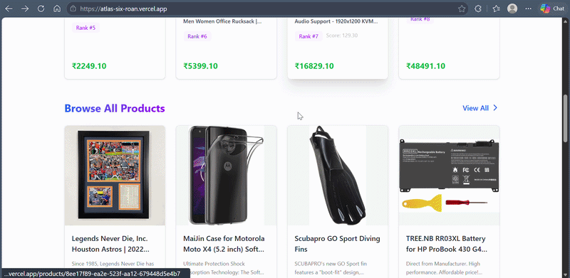

# Atlas - ML-Powered E-Commerce Platform

**Production-grade recommendation platform with active Render/Vercel deployment and preserved Azure AKS history**

🌐 **Live Frontend (Active Production):** https://atlas-six-roan.vercel.app/

🌐 **Previous Deployment (Retained for Documentation/History):** https://4-224-153-183.sslip.io/ (Azure AKS + NGINX Ingress)

Azure AKS documentation remains in this repository as architecture/deployment evidence. The active live deployment moved to Render/Vercel/Neon due to resource constraints, infrastructure migration, and deployment optimization for free-tier operations.

[]()
[]()
[]()
[]()



---

## What is Atlas?

Atlas is a **cloud-native e-commerce platform** with an integrated machine learning recommendation engine. It demonstrates end-to-end system design from model training to production deployment, featuring:

- **React Frontend** with real-time product browsing and personalized recommendations
- **Microservices Backend** (FastAPI) with JWT authentication and catalog management
- **ML Recommendation System** using collaborative filtering (SVD), gradient boosting (LightGBM), and session-aware reranking
- **Active Production Deployment** on Vercel + Render with Neon PostgreSQL and Upstash Redis
- **Historical Deployment Evidence** on Azure Kubernetes Service with NGINX Ingress and HTTPS (retained in docs)
- **Real Product Catalog** with 2,000 Amazon products across 4 categories

The system bridges **offline training** (RetailRocket behavioral dataset) with **online serving** (Amazon product catalog) through a latent mapping layer, enabling realistic recommendations without exposing training data.

---

## Current Live Deployment (Active)

- **Frontend (Vercel)**: https://atlas-six-roan.vercel.app/
- **API Gateway (Render)**: Public Render web service (dashboard-managed URL)
- **Catalog Service (Render)**: Public Render web service (dashboard-managed URL)
- **Recommendation Service (Render)**: Public Render web service (dashboard-managed URL)
- **User Service (Render)**: Public Render web service (dashboard-managed URL)
- **Primary Production Database**: Neon PostgreSQL

### Recommendation Serving Mode in Production

The active cloud deployment runs a **deployment-optimized inference mode**:

- Popularity-based recommendation serving is always available.
- Latent item mappings are loaded dynamically from PostgreSQL.
- Catalog metadata hydration is performed at request time.
- Feature-table loading is disabled in constrained production mode.
- Similarity model loading is disabled in lightweight deployment mode.
- SVD is optional and fallback-safe.
- LightGBM ranking is disabled in constrained deployment mode.

This mode is intentional for reliability on constrained infrastructure. It is not a broken state.

---

## System Capabilities

### Core Features
- [✓] **User Authentication** - JWT-based auth with secure session management
- [✓] **Product Catalog** - 2,000 curated Amazon products with images, prices, descriptions
- [✓] **Category Browsing** - Electronics, Cell Phones, Sports, Software
- [✓] **ML Recommendations** - Three-strategy system (personalized, similarity, popularity)
- [✓] **Session Tracking** - Redis-based session awareness for intent-driven reranking

### ML Personalization (Current State)

**What IS Personalized:**
- [✓] **Item-to-Item Similarity** - Product detail pages show similar items based on features
- [✓] **Session-Aware Reranking** - Recommendations adapt to current browsing session behavior
- [✓] **Popularity Baseline** - Cold start users see globally popular items

**What is NOT (Yet) Personalized:**
- [!] **User-Level Collaborative Filtering** - SVD model is trained but **limited by cold-start problem**:
  - **Root Cause:** Training data (RetailRocket user IDs) ≠ Production data (Atlas UUIDs)
  - **Current Behavior:** New users get popularity fallback (no history to learn from)
  - **Infrastructure:** Model loading, inference pipeline, and feature engineering are **production-ready**
  - **To Enable:** Requires either (a) accumulating production interaction data for retraining, or (b) implementing online embedding updates

This is an **intentional architectural decision** to prioritize deployment readiness over feature completeness. The system is structured to incorporate full personalization once sufficient production data is collected.

---

## Key ML Statistics

### Dataset
- **Training Events**: 2.7M user interactions (RetailRocket)
- **Unique Users**: 1.4M (training dataset)
- **Unique Items**: 235K products (training dataset)
- **Production Catalog**: 2,000 curated Amazon products
- **Time Range**: 137 days of behavioral data (May-Sep 2015)
- **Event Distribution**: Views (96.7%), Add-to-Cart (2.5%), Purchase (0.8%)

### Model Performance
- **LightGBM Ranker**: 16 features, ~2.8MB model size
- **SVD Matrix Factorization**: 10 latent factors, 1.4M user embeddings
- **Item Similarity**: 132K items, 317K similarity pairs
- **Training Split**: 80% train (1.7M events), 20% validation (429K events)
- **Validation Metrics**: Two-Stage Pipeline NDCG@10: 0.9932 (offline), Time-based split to prevent leakage  
  *Note: Offline metric on test data; production expected lower*

### Inference Performance
- **Local Full Pipeline (Reference)**: <200ms target when all artifacts/features are enabled
- **Cloud Deployment-Optimized Mode**: latency depends on cold starts + cross-service metadata hydration
- **Candidate Generation**: popularity + mapping path prioritized in constrained production mode
- **Ranking**: LightGBM disabled in constrained production mode
- **Model Memory Footprint**: full model stack remains available for local/full deployment paths

### Architecture Metrics
- **Microservices**: 5 backend services + 1 frontend
- **Active Production Deployment**: Vercel frontend + Render backend services
- **Historical Deployment**: Azure AKS manifests and architecture retained for documentation/history
- **Database**: Neon PostgreSQL (production), local PostgreSQL for local workflows
- **Redis**: Upstash Redis (production), local Redis for local workflows

---

## Architecture Overview

```
┌─────────────────────────────────────────────────────────────────┐
│                         USERS (Browser)                         │
└────────────────────────────┬────────────────────────────────────┘
                             │ HTTPS (Let's Encrypt)
                             ▼
                  ┌──────────────────────┐
                  │   NGINX Ingress      │
                  │  (TLS Termination)   │
                  └──────────┬───────────┘
                             │
          ┌──────────────────┴──────────────────┐
          │                                     │
          ▼                                     ▼
   ┌─────────────┐                    ┌─────────────────┐
   │  Frontend   │                    │   API Gateway   │
   │  (React)    │                    │   (FastAPI)     │
   │  Port 80    │◄───────────────────┤   Port 8000     │
   └─────────────┘                    └────────┬────────┘
                                               │
                        ┏──────────────────────┼──────────────────────┓
                        ▼                      ▼                      ▼
              ┌──────────────────┐  ┌──────────────────┐  ┌──────────────────┐
              │  User Service    │  │ Catalog Service  │  │ Recommendation   │
              │  (Auth + Users)  │  │ (Products + Cat) │  │ Service (ML)     │
              │  Port 5000       │  │  Port 5004       │  │  Port 5005       │
              └────────┬─────────┘  └────────┬─────────┘  └────────┬─────────┘
                       │                     │                     │
                       └─────────────┬───────┴─────────────────────┘
                                     ▼
                          ┌────────────────────┐
                          │   PostgreSQL 17    │
                          │  (Persistent Data) │
                          └────────────────────┘
                                     
                          ┌────────────────────┐
                          │      Redis 8       │
                          │ (Session Tracking) │
                          └────────────────────┘
```

### Request Flow

1. **User → Ingress**: HTTPS request to `4-224-153-183.sslip.io`
2. **Ingress → Frontend/API**: Routes to frontend (/) or API Gateway (/api/*)
3. **API Gateway → Services**: Proxies to microservices based on path
4. **Services → Database**: Query PostgreSQL for products, users, mappings
5. **Recommendation Service → Redis**: Fetches session data for reranking
6. **Response → User**: JSON data rendered in React UI

### ML Inference Flow

```
User Request (GET /api/v1/recommendations?user_id=X)
    ↓
┌─────────────────────────────────────────────────────┐
│  STAGE 1: Candidate Generation (Recall)             │
│  ├─ Strategy Selection:                             │
│  │   • Has product_id? → Item Similarity (k=100)    │
│  │   • Has user_history? → SVD (k=100) [COLD START] │
│  │   • Else? → Popularity (k=100)                   │
│  └─ Output: 100 candidate product IDs               │
└─────────────────────────────────────────────────────┘
    ↓
┌─────────────────────────────────────────────────────┐
│  STAGE 2: Feature Assembly                          │
│  ├─ Load product metadata from database             │
│  ├─ Compute features: price, category, popularity   │
│  └─ Build feature matrix (100 x 16 features)        │
└─────────────────────────────────────────────────────┘
    ↓
┌─────────────────────────────────────────────────────┐
│  STAGE 3: LightGBM Ranking (Precision)              │
│  ├─ Predict relevance scores for 100 candidates     │
│  ├─ Sort by score (NDCG@10: 0.999 offline)          │
│  │   Note: Offline metric on curated test data;     │
│  │   production performance expected to be lower    │
│  └─ Top 20 products                                 │
└─────────────────────────────────────────────────────┘
    ↓
┌─────────────────────────────────────────────────────┐
│  STAGE 4: Session Reranking (Optional)              │
│  ├─ Fetch session data from Redis                   │
│  ├─ Boost scores for category/price affinity        │
│  │   • Viewed category → +0.1 to +0.3 boost         │
│  │   • Price range match → +0.2 boost               │
│  └─ Final top K products (default: 8)               │
└─────────────────────────────────────────────────────┘
    ↓
Return JSON: [{id, name, price, image_url, category}]
```

---

## Tech Stack

### Frontend
- **React 19** with TypeScript
- **Vite** for build tooling
- **TailwindCSS** for styling
- **Axios** for API communication

### Backend
- **FastAPI** (Python 3.11) - API Gateway, Catalog, Recommendation services
- **PostgreSQL 17** - Persistent storage (products, users, categories, mappings)
- **Redis 8** - Session tracking and caching
- **Alembic** - Database migrations

### ML Stack
- **scikit-learn** - SVD (Truncated SVD collaborative filtering)
- **LightGBM** - Gradient boosting ranker (NDCG optimization)
- **NumPy/Pandas** - Feature engineering and data processing
- **Surprise** (training only) - SVD model training with 10 latent factors

### Infrastructure
- **Docker** - Containerization (5 services)
- **Active Production** - Vercel + Render + Neon PostgreSQL + Upstash Redis
- **Historical Deployment (Retained)** - Kubernetes (Azure AKS) + NGINX Ingress + cert-manager + Azure Container Registry

---

## Running Locally

### Prerequisites
- Docker Desktop with Kubernetes enabled
- Node.js 20+ (for frontend development)
- Python 3.11+ (for backend development)
- 8GB RAM minimum

### Quick Start (Docker Compose)

```bash
# 1. Clone repository
git clone <repository-url>
cd atlas

# 2. Start all services
cd infra
docker-compose up -d

# 3. Run migrations
docker exec infra-user-service-1 alembic upgrade head
docker exec infra-catalog-service-1 alembic upgrade head

# 4. Seed database with products
docker cp tools/seed-data/amazon_products.json infra-db-1:/tmp/
docker cp tools/seed-data/category_mappings.json infra-db-1:/tmp/
docker cp tools/seed-data/seed_k8s_from_files.py infra-db-1:/tmp/
docker exec infra-db-1 bash -c "apt-get update && apt-get install -y python3 python3-pip && \
  pip3 install --break-system-packages sqlalchemy psycopg2-binary && \
  python3 /tmp/seed_k8s_from_files.py"

# 5. Access application
# Frontend: http://localhost:5174
# API Gateway: http://localhost:8000
# API Docs: http://localhost:8000/docs
```

### Services and Ports
- **Frontend**: http://localhost:5174
- **API Gateway**: http://localhost:8000
- **User Service**: http://localhost:5000
- **Catalog Service**: http://localhost:5004
- **Recommendation Service**: http://localhost:5005
- **PostgreSQL**: localhost:5432
- **Redis**: localhost:6379

---

## Deployment Summary

### Active Production Deployment

- **Frontend (Vercel)**: https://atlas-six-roan.vercel.app/
- **Backend Services (Render)**: api-gateway, user-service, catalog-service, recommendation-service
- **Database (Neon)**: shared PostgreSQL for user/catalog/recommendation services
- **Redis (Upstash)**: session-aware recommendation support

### Deployment Constraints and Engineering Decisions

- Render free-tier services run with approximately 512MB memory, so startup and model-loading budgets are tight.
- To keep production stable, heavyweight feature tables and similarity loading are selectively disabled in cloud mode.
- The platform remains functionally complete for browse, auth, catalog, and recommendation delivery using deployment-optimized inference.
- The full ML stack remains available locally:
  - LightGBM ranking
  - Similarity recommender
  - Feature tables
  - SVD model

### Production Database and Seeding Workflow

Production uses Neon PostgreSQL. Database schema and data bootstrapping are independent steps and should be run in this order:

1. Run migrations for user-service and catalog-service.
2. Ingest Amazon catalog export files.
3. Seed catalog entities (sellers, categories, products).
4. Populate latent item mappings.
5. Deploy/restart services after environment and schema are ready.

Reference commands:

```bash
cd services/user-service && alembic upgrade head
cd ../catalog-service && alembic upgrade head

python tools/amazon-integration/ingest_amazon_catalog.py
python tools/amazon-integration/amazon_category_mapper.py
python tools/amazon-integration/seed_catalog_from_amazon.py
python tools/amazon-integration/update_latent_item_mappings.py
```

### Production Environment Variables (Active)

- `CATALOG_SERVICE_URL`
- `RECOMMENDATION_SERVICE_URL`
- `DATABASE_URL`
- `RENDER_DEPLOYMENT_MODE`
- `DISABLE_FEATURE_TABLES`
- `DISABLE_SIMILARITY_MODEL`
- `ENABLE_LIGHTGBM_RANKING`
- `SERVICE_PORT`
- `VITE_API_URL`

### Known Deployment Limitations

- Free-tier cold starts can add startup and first-request latency.
- Cloud production runs deployment-optimized inference mode for memory safety.
- Recommendation latency depends on cross-service metadata hydration and managed-service network hops.
- Email OTP/welcome-mail flows are not part of the current production auth path.

### Azure AKS Setup

**Previous deployment (retained for documentation/history)**

The platform is deployed on **Azure Kubernetes Service** with the following configuration:

- **Cluster**: `atlas-aks` (East US, 1 node)
- **Container Registry**: `atlasacrp1.azurecr.io`
- **Ingress**: NGINX Ingress Controller with Let's Encrypt TLS
- **Public IP**: `4.224.153.183`
- **DNS**: `4-224-153-183.sslip.io` (free wildcard DNS)
- **Certificate**: Let's Encrypt Staging (production rate-limited)

### Why Kubernetes?

1. **Industry Standard**: Demonstrates competency with production orchestration tools
2. **Scalability**: Horizontal pod autoscaling ready (currently 1 replica per service)
3. **Declarative Config**: Infrastructure as code (YAML manifests in `k8s/`)
4. **Service Discovery**: Built-in DNS and load balancing
5. **Rolling Updates**: Zero-downtime deployments
6. **Cloud Portability**: Can migrate to GKE, EKS, or on-premise with minimal changes

---

## Key Design Decisions

### 1. Why Microservices?
- **Separation of Concerns**: Auth, catalog, and ML are independent domains
- **Independent Scaling**: Can scale recommendation service separately from catalog
- **Technology Flexibility**: Could swap services (e.g., Go catalog service) without rewriting system

### 2. Why Offline Training?
- **Data Quality**: Trained on 2.7M real e-commerce events (RetailRocket)
- **Complexity**: SVD requires full matrix decomposition (not real-time feasible)
- **Cost**: Avoid expensive online embedding updates
- **At Current Scale**: Batch retraining is acceptable (<2K products, <1K users)

### 3. Why Not Real-Time Personalization?
- **Cold Start Problem**: New users have no history (SVD can't predict)
- **Data Mismatch**: Training users ≠ Production users (UUID space different)
- **Signal Sparsity**: Need 5-10 interactions per user for meaningful embeddings
- **Infrastructure Ready**: Once production data accumulates, retraining pipeline is in place

### 4. Why Session Reranking?
- **Immediate Value**: Works for brand new users (no history required)
- **Intent Capture**: Current session reveals short-term interests
- **Low Latency**: Redis lookup + score adjustment <10ms
- **Bridge Solution**: Provides personalization until collaborative filtering kicks in

---

## Future Improvements

### ML System
- [ ] **Online Embedding Updates** - Incremental SVD updates with new interactions
- [ ] **Content-Based Filtering** - Use product descriptions/images for cold-start items
- [ ] **A/B Testing Framework** - Compare recommendation strategies
- [ ] **Model Monitoring** - Drift detection, performance dashboards (Prometheus + Grafana)
- [ ] **Click-Through Rate Prediction** - Binary classifier for engagement

### Infrastructure
- [ ] **Horizontal Pod Autoscaling** - Auto-scale based on CPU/memory
- [ ] **Production TLS Certificate** - Wait 7 days for Let's Encrypt rate limit reset
- [ ] **Monitoring Stack** - Prometheus, Grafana, Loki for logs
- [ ] **CI/CD Pipeline** - GitHub Actions for automated testing and deployment
- [ ] **Database Backup** - Automated PostgreSQL backups to Azure Blob Storage

### Features
- [ ] **Shopping Cart Persistence** - Save cart across sessions
- [ ] **Order History** - Track past purchases
- [ ] **Product Reviews** - User-generated content
- [ ] **Search Functionality** - Full-text search with Elasticsearch
- [ ] **Multi-Tenancy** - Support multiple store fronts

---

## Documentation

- **[ARCHITECTURE.md](ARCHITECTURE.md)** - Detailed system design and component interaction
- **[ML_SYSTEM.md](ML_SYSTEM.md)** - Machine learning pipeline, models, and evaluation
- **[DEPLOYMENT.md](DEPLOYMENT.md)** - Historical Azure deployment guide plus active Render/Vercel/Neon blueprint

---

## Dataset Attribution

### Training Data
**RetailRocket Recommender System Dataset**  
- Source: [Kaggle](https://www.kaggle.com/datasets/retailrocket/ecommerce-dataset)
- Size: 2.7M events, 1.4M users, 235K products
- License: Public domain
- Usage: Model training only (not exposed to end users)

### Production Catalog
**Amazon Reviews 2023**  
- Citation: Hou, Y., Zhang, J., Lin, Z., Lu, H., Xie, R., McAuley, J., & Zhao, W. X. (2024). Bridging Language and Items for Retrieval and Recommendation. *arXiv preprint arXiv:2403.03952*.
- Source: [Amazon Reviews 2023](https://amazon-reviews-2023.github.io/)
- Size: 2,000 curated products from 4 categories
- License: Academic use (non-commercial)
- Usage: Production catalog with real product metadata

---

## License

This project is licensed under the **Apache License 2.0** - see the [LICENSE](LICENSE) file for details.

### Dataset Attribution

**ML Models**: Trained on public datasets (RetailRocket, Amazon Reviews)  
**Product Data**: Amazon metadata used under academic license (non-commercial use)  
**Code**: Open source under Apache 2.0

---

## Contact

**Live Demo (Active Production Frontend)**: https://atlas-six-roan.vercel.app/  
**Previous Deployment (Documentation/History)**: https://4-224-153-183.sslip.io/  
**Documentation**: See `ARCHITECTURE.md`, `ML_SYSTEM.md`, `DEPLOYMENT.md`

*Built to demonstrate end-to-end ML system design, cloud deployment, and production engineering practices.*
