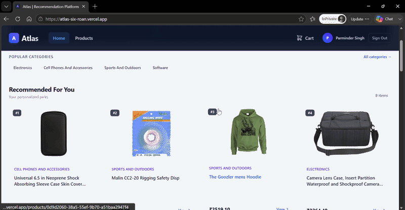

# Atlas — ML-Powered E-Commerce & Personalization Platform

**Production-grade recommendation platform with active cloud deployment (Vercel + Render + OCI + Neon + Upstash) and preserved Azure AKS engineering history**

🌐 **Live Frontend (Active Production):** https://atlas-six-roan.vercel.app/  
🌐 **Historical Deployment (Retained Documentation/Evidence):** https://4-224-153-183.sslip.io/ (Azure AKS + NGINX Ingress)

*Azure AKS documentation remains in this repository as architecture and deployment evidence. The active live deployment runs on Vercel, Render, OCI ML Inference, Neon PostgreSQL, and Upstash Redis.*

[]()
[-green)]()
[]()
[]()



---

## What is Atlas?

Atlas is a **cloud-native e-commerce and recommendation platform** with an integrated machine learning engine. It demonstrates end-to-end system design from offline model training and artifact promotion to multi-service cloud production, featuring:

- **React 18 + Vite Frontend**: High-performance single-page application with real-time product discovery, category filtering, cart management, and guest auth guards.
- **API Gateway**: Coordinated multi-service readiness probing, route proxying, and caching.
- **Catalog Microservice**: Product catalog, category hierarchies, and real-time interaction event ingestion into Neon PostgreSQL.
- **Recommendation Microservice**: Real-time multi-strategy candidate generation, session intent re-ranking via Upstash Redis, and 90-day long-term user personalization.
- **ML Inference Microservice (OCI Host)**: Remote high-throughput model serving hosting Item-Item Co-visitation similarity and LightGBM ranking over 16 behavioral features.
- **User & Authentication Microservice**: JWT authentication, bcrypt password hashing, and single-use 6-digit numeric OTP password recovery via Gmail SMTP (backend service implementation intact; email delivery is limited by Render free-tier outbound SMTP network constraints, so UI informs users to create a new account if needed).
- **Real Product Catalog**: 2,000 curated Amazon products across 4 categories (Electronics, Cell Phones, Sports, Software).

The platform bridges **offline training** (2.7M RetailRocket behavioral events) with **online serving** (Amazon product catalog) through a latent mapping layer, enabling personalized recommendations.

---

## Live Deployed Service Links & Swagger APIs

The production services are live and directly accessible for interactive testing and Swagger/OpenAPI exploration:

| Service | Public URL | Swagger / OpenAPI UI | OpenAPI JSON |
| :--- | :--- | :--- | :--- |
| **Frontend Application** | https://atlas-six-roan.vercel.app/ | — | — |
| **API Gateway** | https://api-gateway-mmoc.onrender.com | [/docs](https://api-gateway-mmoc.onrender.com/docs) | [/openapi.json](https://api-gateway-mmoc.onrender.com/openapi.json) |
| **Catalog Service** | https://catalog-service-uo46.onrender.com | [/docs](https://catalog-service-uo46.onrender.com/docs) | [/openapi.json](https://catalog-service-uo46.onrender.com/openapi.json) |
| **Recommendation Service** | https://recommendation-service-8ag0.onrender.com | [/docs](https://recommendation-service-8ag0.onrender.com/docs) | [/openapi.json](https://recommendation-service-8ag0.onrender.com/openapi.json) |
| **User & Auth Service** | https://user-service-rzbt.onrender.com | [/docs](https://user-service-rzbt.onrender.com/docs) | [/openapi.json](https://user-service-rzbt.onrender.com/openapi.json) |
| **ML Inference Engine (OCI)** | http://150.230.143.133:8001 | [/docs](http://150.230.143.133:8001/docs) | [/openapi.json](http://150.230.143.133:8001/openapi.json) |

*Note on Free-Tier Operation: Render services sleep after 15 minutes of inactivity and require ~25–35s for container cold starts. The frontend bypasses the API Gateway specifically when waking the Catalog, Recommendation, and User services because Render blocks/rejects the wakeup call when one Render service attempts to wake another sleeping Render service. The frontend therefore directly triggers those three Render services first, after which the existing API Gateway readiness logic performs the authoritative readiness checks.*

---

## Recommendation & Personalization Architecture

### Multi-Strategy Pipeline

```
User Request (GET /api/v1/recommendations?user_id=...&k=8)
    ↓
┌─────────────────────────────────────────────────────────────────────────┐
│ 1. CANDIDATE GENERATION (Recall Layer)                                  │
│   • Item Similarity (TF-IDF Co-visitation via OCI :8001)               │
│   • Category Similarity (Product detail fallback)                       │
│   • Global Popularity Baseline (Cold start fallback)                    │
│   • SVD Collaborative Filtering (Preserved in offline training/Swagger) │
└────────────────────────────────────┬────────────────────────────────────┘
                                     │ (100 candidates)
                                     ▼
┌─────────────────────────────────────────────────────────────────────────┐
│ 2. TWO-STAGE LIGHTGBM RE-RANKING (OCI Host :8001)                      │
│   • 16 behavioral features (user recency, item conversion, popularity)  │
│   • LambdaRank NDCG optimization                                        │
└────────────────────────────────────┬────────────────────────────────────┘
                                     │ (Ranked candidates)
                                     ▼
┌─────────────────────────────────────────────────────────────────────────┐
│ 3. REAL-TIME SESSION INTENT RE-RANKING (Upstash Redis)                 │
│   • Category views & product views in active session                   │
│   • Dynamic bounded score boost: +0.35 to +0.60 * score span           │
│   • Score-space invariant (preserves rank bounds without runaway scale)│
└────────────────────────────────────┬────────────────────────────────────┘
                                     │
                                     ▼
┌─────────────────────────────────────────────────────────────────────────┐
│ 4. LONG-TERM USER PERSONALIZATION (Neon PostgreSQL)                    │
│   • 90-day historical interaction profile (view/cart/buy weights)       │
│   • Bounded category affinity boost: +0.10 * score span                 │
└────────────────────────────────────┬────────────────────────────────────┘
                                     │
                                     ▼
Final Hydrated Recommendations returned to UI (Top K: 8 items)
```

### SVD Collaborative Filtering: Offline vs. Online Serving
- **Dataset**: Matrix factorization trained on 2.7M RetailRocket interactions across 1.4M users and 235K items (10 latent components).
- **Online Production Serving Status**: Intentionally **disabled** in the default frontend recommendation path because RetailRocket user integer IDs differ from live Atlas user UUIDs, preventing artificial cold-start failure.
- **Offline & Swagger Testing Availability**: Fully preserved in `training/` pipeline, offline evaluations, and directly testable on the OCI ML Swagger endpoint using RetailRocket item/user IDs (e.g. Item ID `359491` or `1000`).

---

## System Capabilities Truth Table

| Capability | Status | Implementation Location | Active in Prod | Architectural Notes |
| :--- | :---: | :--- | :---: | :--- |
| **Item-Item Similarity** | Trained & Active | OCI Host (`:8001`) + FastAPI | **YES** | Content & co-visitation similarity for similar products |
| **Popularity Baseline** | Active | PostgreSQL / Redis | **YES** | Global baseline ensuring robust category coverage |
| **LightGBM Re-Ranker** | Trained & Active | OCI Host (`:8001`) | **YES** | 16-feature ranking model trained with LambdaRank |
| **Session Intent Re-Ranking** | Active | Upstash Redis | **YES** | Bounded intent boost (+0.35 to +0.60 $\times$ span) |
| **Long-Term Personalization** | Active | Neon PostgreSQL Events | **YES** | 90-day category preference profile (+0.10 $\times$ span) |
| **SVD Matrix Factorization** | Offline / Testing | `training/` & OCI Swagger | **OFFLINE** | Preserved for offline retraining & Swagger testing |
| **PostgreSQL Event Ingestion** | Active | Catalog Service / Neon | **YES** | Real-time logging of views, clicks, and cart events |
| **Coordinated Startup Gate** | Active | API Gateway (`/api/v1/ready`) | **YES** | Probes dependencies and gates UI during cold boot |
| **Guest Cart Redirect Guard** | Active | React Frontend Auth Router | **YES** | Redirects guests to `/login` with return path |
| **Single-Use OTP Password Reset** | Backend Implemented / Free-Tier Limited | User Service / PostgreSQL | **BACKEND ONLY** | 6-digit numeric OTP with 15m expiration & Gmail SMTP implemented in service; free-tier deployment restricts outbound SMTP egress, so frontend presents informative limitation advisory |

## Architecture Overview

### Active Production Architecture (Render + Vercel)

```
┌─────────────────────────────────────────────────────────────────┐
│                         USERS (Browser)                         │
└────────────────────────────┬────────────────────────────────────┘
                             │ HTTPS (TLS 1.3)
                             ▼
                  ┌──────────────────────┐
                  │   Frontend (Vercel)  │
                  │   (React / Vite)     │
                  └──────────┬───────────┘
                             │ HTTPS (REST API)
                             ▼
                  ┌──────────────────────┐
                  │     API Gateway      │
                  │   (FastAPI / Render) │
                  └──────────┬───────────┘
                             │
          ┌──────────────────┼──────────────────┐
          ▼                  ▼                  ▼
┌──────────────────┐┌──────────────────┐┌──────────────────┐
│   User Service   ││ Catalog Service  ││ Recommendation   │
│  (Auth + Users)  ││ (Products + Cat) ││   Service (ML)   │
│(FastAPI / Render)││(FastAPI / Render)││(FastAPI / Render)│
└────────┬─────────┘└────────┬─────────┘└────────┬─────────┘
         │                   │                   │
         └─────────────┬─────┴───────────────────┘
                       │
                       ▼
          ┌────────────────────────┐
          │    Neon PostgreSQL     │
          │   (Persistent Data)    │
          └────────────────────────┘
                       
          ┌────────────────────────┐
          │     Upstash Redis      │
          │   (Session Tracking)   │
          └────────────────────────┘
```

### Historical Azure AKS Topology (Retained for Evidence)

```
┌─────────────────────────────────────────────────────────────────┐
│                         USERS (Browser)                         │
└────────────────────────────┬────────────────────────────────────┘
                             │ HTTPS (Let's Encrypt)
                             ▼
                  ┌──────────────────────┐
                  │   NGINX Ingress      │
                  │  (TLS Termination)   │
                  └──────────┬───────────┘
                             │
          ┌──────────────────┴──────────────────┐
          │                                     │
          ▼                                     ▼
   ┌─────────────┐                    ┌─────────────────┐
   │  Frontend   │                    │   API Gateway   │
   │  (React)    │                    │   (FastAPI)     │
   │  Port 80    │◄───────────────────┤   Port 8000     │
   └─────────────┘                    └────────┬────────┘
                                               │
                        ┏──────────────────────┼──────────────────────┓
                        ▼                      ▼                      ▼
              ┌──────────────────┐  ┌──────────────────┐  ┌──────────────────┐
              │  User Service    │  │ Catalog Service  │  │ Recommendation   │
              │  (Auth + Users)  │  │ (Products + Cat) │  │ Service (ML)     │
              │  Port 5000       │  │  Port 5004       │  │  Port 5005       │
              └────────┬─────────┘  └────────┬─────────┘  └────────┬─────────┘
                       │                     │                     │
                       └─────────────┬───────┴─────────────────────┘
                                     ▼
                          ┌────────────────────┐
                          │   PostgreSQL 17    │
                          │  (Persistent Data) │
                          └────────────────────┘
                                     
                          ┌────────────────────┐
                          │      Redis 8       │
                          │ (Session Tracking) │
                          └────────────────────┘
```

### Request Flow

1. **User → Vercel**: HTTPS request to `https://atlas-six-roan.vercel.app/`
2. **Frontend → API Gateway**: API calls directed to Render API Gateway base URL (`/api/*`)
3. **API Gateway → Microservices**: Gateway proxies to downstream Render services (`user-service`, `catalog-service`, `recommendation-service`)
4. **Services → Database**: Microservices query Neon PostgreSQL for products, users, mappings
5. **Recommendation Service → Redis**: Fetches active session state from Upstash Redis for reranking
6. **Response → User**: Enriched JSON data rendered in React UI

*(Historical Azure ingress flow via `4-224-153-183.sslip.io` remains documented in deployment history)*

### ML Inference Flow

```
User Request (GET /api/v1/recommendations?user_id=X)
    ↓
┌─────────────────────────────────────────────────────┐
│  STAGE 1: Candidate Generation (Recall)             │
│  ├─ Strategy Selection:                             │
│  │   • Has product_id? → Item Similarity (k=100)    │
│  │   • Has user_history? → SVD (k=100) [COLD START] │
│  │   • Else? → Popularity (k=100)                   │
│  └─ Output: 100 candidate product IDs               │
└─────────────────────────────────────────────────────┘
    ↓
┌─────────────────────────────────────────────────────┐
│  STAGE 2: Feature Assembly                          │
│  ├─ Load product metadata from database             │
│  ├─ Compute features: price, category, popularity   │
│  └─ Build feature matrix (100 x 16 features)        │
└─────────────────────────────────────────────────────┘
    ↓
┌─────────────────────────────────────────────────────┐
│  STAGE 3: LightGBM Ranking (Precision)              │
│  ├─ Predict relevance scores for 100 candidates     │
│  ├─ Sort by score (NDCG@10: 0.999 offline)          │
│  │   Note: Offline metric on curated test data;     │
│  │   production performance expected to be lower    │
│  └─ Top 20 products                                 │
└─────────────────────────────────────────────────────┘
    ↓
┌─────────────────────────────────────────────────────┐
│  STAGE 4: Session Reranking (Optional)              │
│  ├─ Fetch session data from Redis                   │
│  ├─ Boost scores for category/price affinity        │
│  │   • Viewed category → +0.1 to +0.3 boost         │
│  │   • Price range match → +0.2 boost               │
│  └─ Final top K products (default: 8)               │
└─────────────────────────────────────────────────────┘
    ↓
Return JSON: [{id, name, price, image_url, category}]
```

---

## Tech Stack

### Frontend
- **React 19** with TypeScript
- **Vite** for build tooling
- **TailwindCSS** for styling
- **Axios** for API communication

### Backend
- **FastAPI** (Python 3.11) - API Gateway, Catalog, Recommendation services
- **PostgreSQL 17** - Persistent storage (products, users, categories, mappings)
- **Redis 8** - Session tracking and caching
- **Alembic** - Database migrations

### ML Stack
- **scikit-learn** - SVD (Truncated SVD collaborative filtering)
- **LightGBM** - Gradient boosting ranker (NDCG optimization)
- **NumPy/Pandas** - Feature engineering and data processing
- **Surprise** (training only) - SVD model training with 10 latent factors

### Infrastructure
- **Docker** - Containerization (5 services)
- **Active Production** - Vercel + Render + Neon PostgreSQL + Upstash Redis
- **Historical Deployment (Retained)** - Kubernetes (Azure AKS) + NGINX Ingress + cert-manager + Azure Container Registry

---

## Running Locally

### Prerequisites
- Docker Desktop with Kubernetes enabled
- Node.js 20+ (for frontend development)
- Python 3.11+ (for backend development)
- 8GB RAM minimum

### Quick Start (Docker Compose)

```bash
# 1. Clone repository
git clone <repository-url>
cd atlas

# 2. Start all services
cd infra
docker-compose up -d

# 3. Run migrations
docker exec infra-user-service-1 alembic upgrade head
docker exec infra-catalog-service-1 alembic upgrade head

# 4. Seed database with products
docker cp tools/seed-data/amazon_products.json infra-db-1:/tmp/
docker cp tools/seed-data/category_mappings.json infra-db-1:/tmp/
docker cp tools/seed-data/seed_k8s_from_files.py infra-db-1:/tmp/
docker exec infra-db-1 bash -c "apt-get update && apt-get install -y python3 python3-pip && \
  pip3 install --break-system-packages sqlalchemy psycopg2-binary && \
  python3 /tmp/seed_k8s_from_files.py"

# 5. Access application
# Frontend: http://localhost:5174
# API Gateway: http://localhost:8000
# API Docs: http://localhost:8000/docs
```

### Services and Ports
- **Frontend**: http://localhost:5174
- **API Gateway**: http://localhost:8000
- **User Service**: http://localhost:5000
- **Catalog Service**: http://localhost:5004
- **Recommendation Service**: http://localhost:5005
- **PostgreSQL**: localhost:5432
- **Redis**: localhost:6379

---

## Deployment Summary

### Active Production Deployment

- **Frontend (Vercel)**: https://atlas-six-roan.vercel.app/
- **Backend Services (Render)**: api-gateway, user-service, catalog-service, recommendation-service
- **Database (Neon)**: shared PostgreSQL for user/catalog/recommendation services
- **Redis (Upstash)**: session-aware recommendation support

### Deployment Constraints and Engineering Decisions

- Render free-tier services run with approximately 512MB memory, so startup and model-loading budgets are tight.
- To keep production stable, heavyweight feature tables and similarity loading are selectively disabled in cloud mode.
- The platform remains functionally complete for browse, auth, catalog, and recommendation delivery using deployment-optimized inference.
- The full ML stack remains available locally:
  - LightGBM ranking
  - Similarity recommender
  - Feature tables
  - SVD model

### Production Database and Seeding Workflow

Production uses Neon PostgreSQL. Database schema and data bootstrapping are independent steps and should be run in this order:

1. Run migrations for user-service and catalog-service.
2. Ingest Amazon catalog export files.
3. Seed catalog entities (sellers, categories, products).
4. Populate latent item mappings.
5. Deploy/restart services after environment and schema are ready.

Reference commands:

```bash
cd services/user-service && alembic upgrade head
cd ../catalog-service && alembic upgrade head

python tools/amazon-integration/ingest_amazon_catalog.py
python tools/amazon-integration/amazon_category_mapper.py
python tools/amazon-integration/seed_catalog_from_amazon.py
python tools/amazon-integration/update_latent_item_mappings.py
```

### Production Environment Variables (Active)

- `CATALOG_SERVICE_URL`
- `RECOMMENDATION_SERVICE_URL`
- `DATABASE_URL`
- `RENDER_DEPLOYMENT_MODE`
- `DISABLE_FEATURE_TABLES`
- `DISABLE_SIMILARITY_MODEL`
- `ENABLE_LIGHTGBM_RANKING`
- `SERVICE_PORT`
- `VITE_API_URL`

### Known Deployment Limitations

- Free-tier cold starts can add startup and first-request latency.
- Cloud production runs deployment-optimized inference mode for memory safety.
- Recommendation latency depends on cross-service metadata hydration and managed-service network hops.
- Email OTP/welcome-mail flows are not part of the current production auth path.

### Azure AKS Setup

**Previous deployment (retained for documentation/history)**

The platform was historically deployed on **Azure Kubernetes Service** with the following configuration:

- **Cluster**: `atlas-aks` (East US, 1 node)
- **Container Registry**: `atlasacrp1.azurecr.io`
- **Ingress**: NGINX Ingress Controller with Let's Encrypt TLS
- **Public IP**: `4.224.153.183`
- **DNS**: `4-224-153-183.sslip.io` (free wildcard DNS)
- **Certificate**: Let's Encrypt Staging (production rate-limited)

### Why Kubernetes?

1. **Industry Standard**: Demonstrates competency with production orchestration tools
2. **Scalability**: Horizontal pod autoscaling ready (currently 1 replica per service)
3. **Declarative Config**: Infrastructure as code (YAML manifests in `k8s/`)
4. **Service Discovery**: Built-in DNS and load balancing
5. **Rolling Updates**: Zero-downtime deployments
6. **Cloud Portability**: Can migrate to GKE, EKS, or on-premise with minimal changes

---

## Key Design Decisions

### 1. Why Microservices?
- **Separation of Concerns**: Auth, catalog, and ML are independent domains
- **Independent Scaling**: Can scale recommendation service separately from catalog
- **Technology Flexibility**: Could swap services (e.g., Go catalog service) without rewriting system

### 2. Why Offline Training?
- **Data Quality**: Trained on 2.7M real e-commerce events (RetailRocket)
- **Complexity**: SVD requires full matrix decomposition (not real-time feasible)
- **Cost**: Avoid expensive online embedding updates
- **At Current Scale**: Batch retraining is acceptable (<2K products, <1K users)

### 3. Why Not Real-Time Personalization?
- **Cold Start Problem**: New users have no history (SVD can't predict)
- **Data Mismatch**: Training users ≠ Production users (UUID space different)
- **Signal Sparsity**: Need 5-10 interactions per user for meaningful embeddings
- **Infrastructure Ready**: Once production data accumulates, retraining pipeline is in place

### 4. Why Session Reranking?
- **Immediate Value**: Works for brand new users (no history required)
- **Intent Capture**: Current session reveals short-term interests
- **Low Latency**: Redis lookup + score adjustment <10ms
- **Bridge Solution**: Provides personalization until collaborative filtering kicks in

---

## Future Improvements

### ML System
- [ ] **Online Embedding Updates** - Incremental SVD updates with new interactions
- [ ] **Content-Based Filtering** - Use product descriptions/images for cold-start items
- [ ] **A/B Testing Framework** - Compare recommendation strategies
- [ ] **Model Monitoring** - Drift detection, performance dashboards (Prometheus + Grafana)
- [ ] **Click-Through Rate Prediction** - Binary classifier for engagement

### Infrastructure
- [ ] **Horizontal Pod Autoscaling** - Auto-scale based on CPU/memory
- [ ] **Production TLS Certificate** - Wait 7 days for Let's Encrypt rate limit reset
- [ ] **Monitoring Stack** - Prometheus, Grafana, Loki for logs
- [ ] **CI/CD Pipeline** - GitHub Actions for automated testing and deployment
- [ ] **Database Backup** - Automated PostgreSQL backups to Azure Blob Storage

### Features
- [ ] **Shopping Cart Persistence** - Save cart across sessions
- [ ] **Order History** - Track past purchases
- [ ] **Product Reviews** - User-generated content
- [ ] **Search Functionality** - Full-text search with Elasticsearch
- [ ] **Multi-Tenancy** - Support multiple store fronts

---

## Documentation

- **[ARCHITECTURE.md](ARCHITECTURE.md)** - Detailed system design and component interaction
- **[ML_SYSTEM.md](ML_SYSTEM.md)** - Machine learning pipeline, models, and evaluation
- **[DEPLOYMENT.md](DEPLOYMENT.md)** - Historical Azure deployment guide plus active Render/Vercel/Neon blueprint

---

## Dataset Attribution

### Training Data
**RetailRocket Recommender System Dataset**  
- Source: [Kaggle](https://www.kaggle.com/datasets/retailrocket/ecommerce-dataset)
- Size: 2.7M events, 1.4M users, 235K products
- License: Public domain
- Usage: Model training only (not exposed to end users)

### Production Catalog
**Amazon Reviews 2023**  
- Citation: Hou, Y., Zhang, J., Lin, Z., Lu, H., Xie, R., McAuley, J., & Zhao, W. X. (2024). Bridging Language and Items for Retrieval and Recommendation. *arXiv preprint arXiv:2403.03952*.
- Source: [Amazon Reviews 2023](https://amazon-reviews-2023.github.io/)
- Size: 2,000 curated products from 4 categories
- License: Academic use (non-commercial)
- Usage: Production catalog with real product metadata

---

## License

This project is licensed under the **Apache License 2.0** - see the [LICENSE](LICENSE) file for details.

### Dataset Attribution

**ML Models**: Trained on public datasets (RetailRocket, Amazon Reviews)  
**Product Data**: Amazon metadata used under academic license (non-commercial use)  
**Code**: Open source under Apache 2.0

---

## Contact

**Live Demo (Active Production Frontend)**: https://atlas-six-roan.vercel.app/  
**Previous Deployment (Documentation/History)**: https://4-224-153-183.sslip.io/  
**Documentation**: See `ARCHITECTURE.md`, `ML_SYSTEM.md`, `DEPLOYMENT.md`

*Built to demonstrate end-to-end ML system design, cloud deployment, and production engineering practices.*
